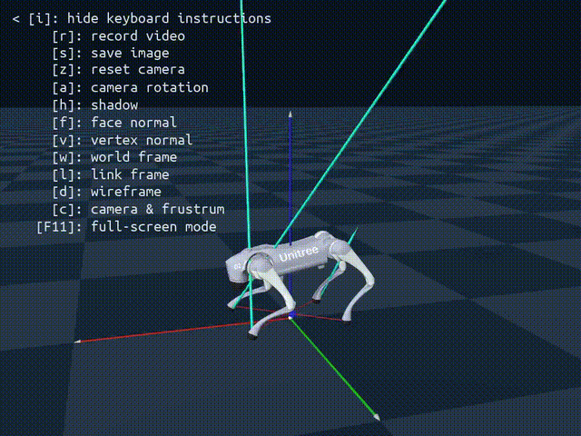

# Genesis-backflip

A functional and streamlined codebase for locomotion training in Genesis, featuring:
- Effective domain randomizations and useful rewards
- Fundamental rewards for executing a complete backflip

We use the same domain randomizations as in this repository in both single and double backflips. During deployment, we slightly changed Kps used on the real robot to do a clean backflip.

## Demo Video



> **Note**: The GIF above shows the backflip demo. For higher quality, you can also [watch the MP4 version](https://github.com/lu-yidan/Genesis-backflip/raw/lu_dev/doc/record.mp4).

## Requirements

- Python 3.10
- Genesis World 0.2.0

## Installation

1. Create a conda environment with Python 3.10:
   ```
   conda create -n genesis python==3.10
   ```

2. Activate the conda environment:
   ```
   conda activate genesis
   ```

3. Install Genesis World:
   ```
   pip install genesis-world==0.2.0
   ```

## Usage

1. Install the modified version rsl_rl

    ```
    cd rsl_rl && pip install -e .
    ```

2. Train the Unitree Go2 for a backflip

    This codebase includes only the fundamental rewards required for learning a backflip. You can observe how Go2 learns to perform a full backflip by running:
    ```
    python train_backflip.py -e EXP_NAME
    ```

3. Evaluate existing checkpoints

    Run
    ```
    python eval_backflip.py -e EXP_NAME --ckpt NUM_CKPT
    ```

4. Generate a deployable checkpoint

    To produce a deployable checkpoint comparable to the provided example in Genesis, additional rewards must be incorporated to regularize motion and minimize torque peaks.

## Acknoledgement

This codebase was inspired [legged_gym](https://github.com/leggedrobotics/legged_gym) and its reward design principles.